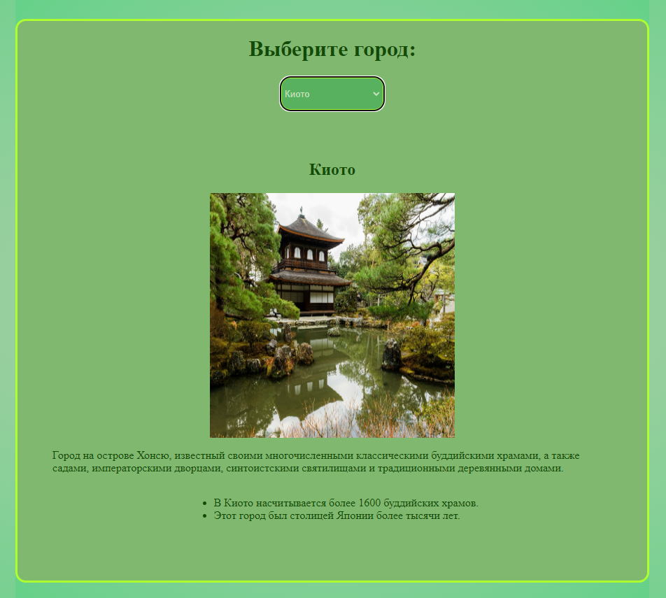
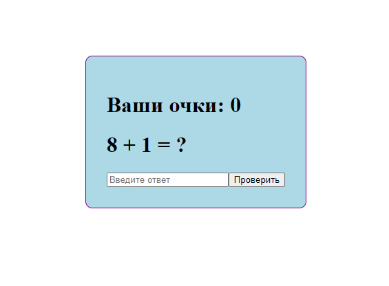

## React домашнее задание 4

### Задание 1

**Создадим приложение "City Cards" на React**

1. Инициализация проекта: Используйте create-react-app для создания начального шаблона вашего приложения. Произведите предварительную настройку проекта
2. Создание компонента CitySelector: Разработайте компонент для выбора города. Этот компонент должен включать в себя форму с выпадающим списком, который позволяет выбирать из предопределенного списка городов.
3. Создание компонента CityCard: Сосредоточьтесь на создании карточки города, которая будет отображать изображение, описание и интересные факты о выбранном городе. 
4. Подготовка данных: В компоненте CityCelector определите массив объектов в JavaScript, содержащий информацию о каждом городе, включая название, описание, изображение и факты.
5. Управление состоянием: В компоненте App спользуйте хук состояния useState, чтобы отправлять данные о выбранном городе в отображаемую карточку.
6. Динамическое отображение: Напишите логику, которая позволит при выборе города в CitySelector отображать соответствующую CityCard.
7. Стилизация: Примените стили к вашим компонентам.
8. Проверка функциональности: Запустите приложение, убедитесь, что все части интерфейса работают корректно и данные правильно обновляются при выборе города.

### Задание 2

**Создадим приложение "Math Quiz" на React**, которое предоставляет пользователю математическую задачу на сложение и оценивает его ответы, начисляя или снимая баллы за каждый правильный или неправильный ответ соответственно.

1. Инициализация проекта: Используйте create-react-app для создания начального шаблона вашего приложения. Это поможет вам быстро настроить рабочее окружение для разработки React-приложения.
2. Создание компонента MathQuiz: Компонент MathQuiz организует основную логику игры, включая генерацию случайных чисел для задачи, отображение текущего счёта и интеграцию с компонентом Answer для приёма и проверки ответов пользователя.
3. Создание компонента Answer: Компонент Answer предоставляет форму для ввода ответа пользователя, обрабатывает его ввод и отправляет введённую информацию на проверку. Он связан с компонентом MathQuiz через функцию updatePoints, которая вызывается при подаче формы.
4. Подготовка данных: В MathQuiz используются две переменные a и b, генерируемые случайным образом для формирования задачи на сложение. Эти данные и функция обновления счёта updatePoints передаются в Answer.
5. Управление состоянием: Используйте хук useState в компоненте MathQuiz для отслеживания текущего счёта пользователя. В компоненте Answer используйте useState для управления вводом пользователя.
6. Динамическое отображение: MathQuiz отображает задачу и текущий счёт, а Answer обеспечивает интерфейс для ввода ответа и отправляет его на проверку, после чего MathQuiz обновляет счёт.
7. Стилизация: Примените CSS стили для улучшения визуального представления компонентов.
8. Проверка функциональности: Запустите приложение и убедитесь, что данные корректно генерируются, ответы правильно обрабатываются, и счёт изменяется в зависимости от правильности ответов пользователя.

