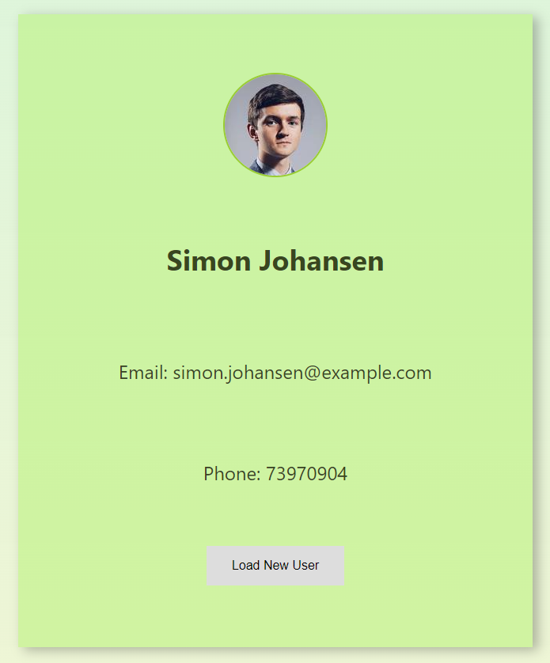

## React домашнее задание 6

### Задание 1

Создание простого приложения в React для отображения данных пользователя

Шаг 1: Настройка проекта
1. Используйте Create React App для создания нового проекта.
2. Перейдите в директорию проекта:
3. Установите библиотеку axios для выполнения HTTP-запросов:

Шаг 2: Подготовка файлов проекта
1. Создайте файл UserProfile.jsx в директории src. В этом файле вы будете реализовывать компонент для отображения данных пользователя.
2. Создайте файл стилей UserProfile.module.css в той же директории, что и UserProfile.jsx. Эти стили будет применять к компоненту UserProfile.
3. Откройте файл App.js и импортируйте компонент UserProfile из созданного файла.

Шаг 3: Разработка компонента UserProfile
1. В файле UserProfile.jsx, импортируйте React, useState, useEffect из библиотеки react, импортируйте axios.
2. Импортируйте файл стилей UserProfile.module.css.
3. Определите функциональный компонент UserProfile, используя useState для создания состояния user.
4. Используйте useEffect для вызова функции загрузки данных пользователя при монтировании компонента.
5. Напишите асинхронную функцию fetchUser, которая будет загружать данные пользователя через API и обновлять состояние user.
https://randomuser.me/api
6. В теле компонента добавьте условие проверки загрузки данных (её состояние). Если данные загружены, отображайте информацию о пользователе. Если данные еще загружаются, отображайте сообщение "Loading...".

Шаг 4: Стилизация компонента
1. Откройте файл UserProfile.module.css и добавьте необходимые CSS-классы для стилизации элементов компонента UserProfile.
2. Примените эти классы к соответствующим элементам в JSX коде компонента UserProfile.

Шаг 5: Добавление кнопки для загрузки новых данных
1. В UserProfile, добавьте кнопку, которая позволит пользователю загружать нового случайного пользователя.
2. Задайте обработчик события для этой кнопки, который будет вызывать функцию fetchUser при клике.

Шаг 6: Тестирование приложения
1. Выполните команду npm start для запуска вашего приложения.
2. Проверьте правильность отображения данных о пользователе и функциональность кнопки для загрузки нового пользователя.

