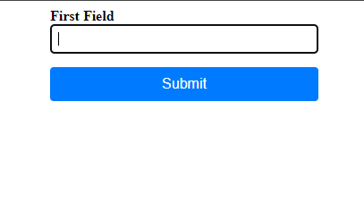
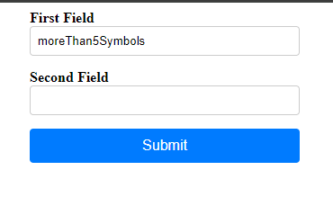

## React домашнее задание 9

### Задание

**Создание приложения, в котором второе поле ввода появляется только после того, как первое поле успешно прошло проверку на минимальную длину**

1. Установка и настройка проекта

- Создайте новый проект React: В терминале выполните команду:
npx create-react-app dynamic-form
Это создаст новый проект React с именем `dynamic-form`.
- Перейдите в директорию проекта:
cd dynamic-form
- Установите `react-hook-form`:
npm install react-hook-form

2. Создание структуры проекта

- Создайте директорию для компонентов:
В директории `src` создайте папку `components`.
- Создайте файл для компонента формы:
В папке `components` создайте файл `DynamicForm.jsx`.
- Создайте файл для модульных стилей:
В папке `components` создайте файл `DynamicForm.module.css`.

3. Создание компонента `DynamicForm`

- Импортируйте необходимые модули в `DynamicForm.jsx`:
Импортируйте `React` из `react`.
Импортируйте необходимые функции из `react-hook-form`.
Импортируйте стили из `DynamicForm.module.css`.
- Создайте компонент `DynamicForm`:
Используйте хук `useForm` для управления состоянием и валидацией формы.
Создайте функцию `onSubmit`, которая будет обрабатывать отправку формы.
Используйте `watch` для отслеживания значений полей ввода.
Определите условие для отображения второго поля ввода на основе значения первого поля.
Реализуйте JSX-разметку формы, добавив стили из CSS-модуля.

4. Создание модульных стилей

- Откройте файл `DynamicForm.module.css`:
Определите стили для различных элементов формы, включая контейнеры, метки, поля ввода, сообщения об ошибках и кнопку отправки.

5. Настройка главного компонента приложения

- Откройте файл `App.jsx` в корневой директории `src`:
Импортируйте `React` и компонент `DynamicForm`.
Создайте компонент `App`, который будет рендерить заголовок и компонент `DynamicForm`.

6. Запуск приложения

- Запустите проект:
В терминале выполните команду:
npm start

7. Тестирование и отладка

- Проверьте функциональность формы:
Убедитесь, что первое поле ввода отображается и валидируется правильно.
Введите значение, соответствующее условиям валидации, и проверьте, что второе поле ввода появляется.
Проверьте, что ошибки валидации отображаются корректно.
- Отладка при необходимости:
Если что-то не работает, откройте консоль разработчика в браузере и посмотрите на сообщения об ошибках.
Проверьте, правильно ли импортированы и подключены все файлы и стили.

