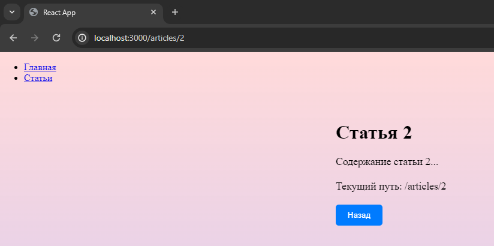

## React домашнее задание 11

### Задание

**Создание простого блога с использованием React и react-router-dom.**

1. Настройка проекта:

- Создайте новый проект React с помощью Create React App.
- Установите библиотеку react-router-dom с помощью npm или yarn.

2. Создание компонентов:

- Создайте компоненты для каждой страницы: Главная страница, Страница списка статей и Страница отдельной статьи.
- В каждом компоненте определите необходимый контент для отображения (например, текст, заголовки, ссылки).

3. Настройка маршрутизации:

- Импортируйте BrowserRouter, Routes, Route, Link, NavLink из библиотеки react-router-dom в корневом файле вашего приложения.
- Определите маршруты внутри компонента Routes. Каждый маршрут должен соответствовать пути к определенной странице вашего приложения.
- Для каждой страницы создайте соответствующий Route компонент, указав путь и компонент, который должен отображаться при совпадении этого пути.

4. Добавление навигации:

- Воспользуйтесь компонентами Link или NavLink для создания ссылок между страницами вашего приложения. Убедитесь, что они ведут на правильные маршруты.

5. Обработка параметров маршрута:

- Внутри компонента отдельной статьи используйте хук useParams() для извлечения параметров маршрута (например, идентификатора статьи) и загрузки соответствующей статьи для отображения.

6. Навигация внутри приложения:

- Для навигации между страницами используйте хук useNavigate() для динамической навигации внутри вашего приложения.

7. Добавление стилей:

- Создайте модульные CSS-стили для каждого компонента, используя синтаксис CSS-модулей или другие методы стилизации React.
Примените стили к соответствующим элементам каждого компонента, чтобы стилизовать внешний вид приложения.

8. Тестирование и запуск:

- Запустите приложение и убедитесь, что навигация между страницами работает корректно, каждая страница отображается с правильным контентом и стили применены правильно.

